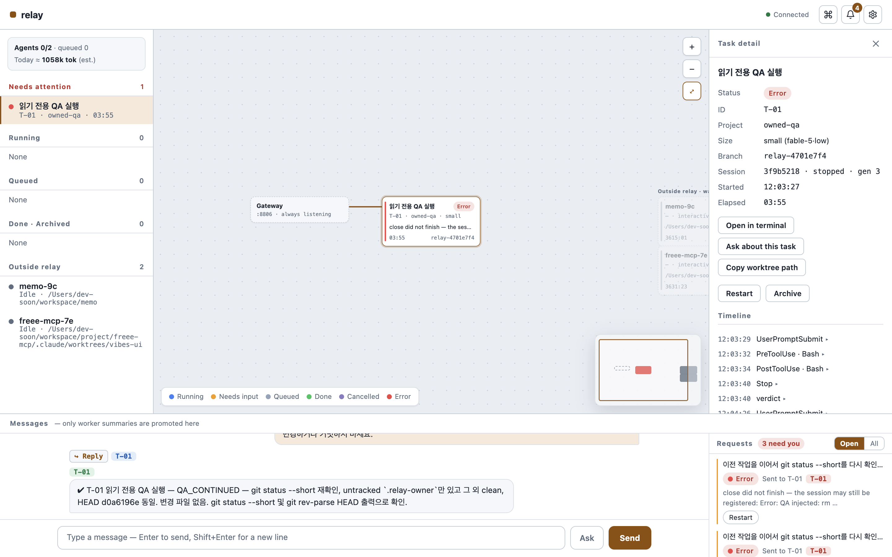
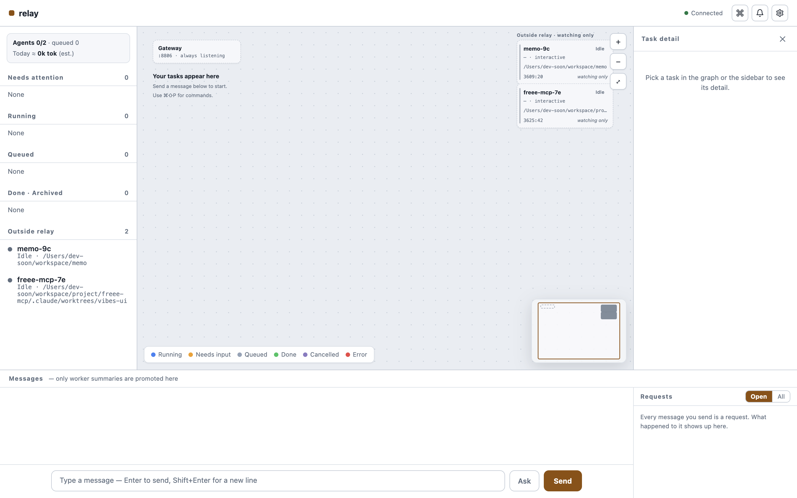
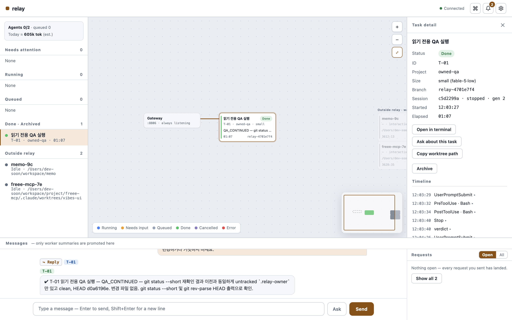
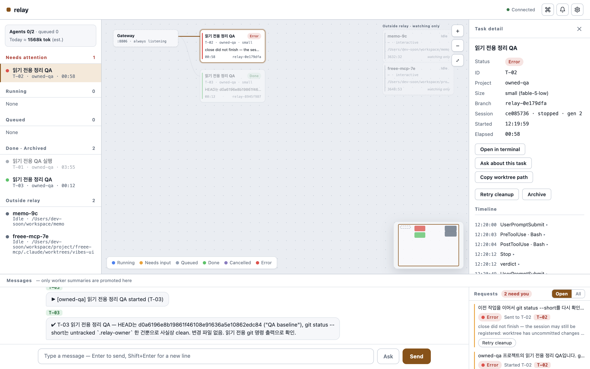
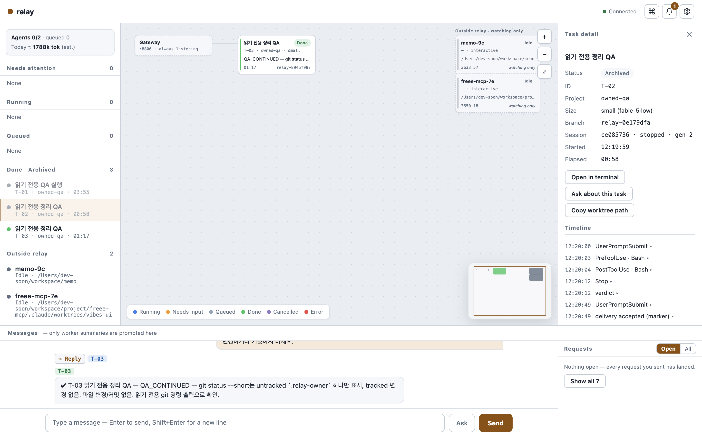

# Owned-session cleanup QA — 2026-09-05

## Scope and baseline

Started from refreshed `origin/main` `1cd3ebe` (PR #52). That PR's 357-pass dashboard QA remains recorded in [the original report](QA-2026-09-05.md). This pass addresses a bounded part of [#37](https://github.com/JeongJaeSoon/relay/issues/37): cleanup command evidence, stop-before-remove barriers, complete close/retry behavior, and late spawn/resume acknowledgement races.

## Reproduced defects and fixes

- Superseded stop/rm exceptions and failed roster observations were recorded as `applied`. They now remain `unknown`, visible and retryable.
- An unknown stop could be bypassed by a new close rm. All stop commands precede removals; unresolved stop commands block removals.
- A stale stopped task projection permitted deletion with a live generation still on the roster. Every rm checks all known generation identities and sessions sharing the known worktree. A foreign session may block removal but is never stopped automatically.
- Close skipped stop when its task projection said stopped. A recorded identity now gets a stop even when its projection is terminal.
- Native stop/rm failures could look successful. Nonzero exits propagate; successful rm also requires absence from a fresh full roster.
- Actual Claude resume delivered SessionStart before its launcher returned; the late acknowledgement reset the task to `starting`. Spawn/resume now reload the task and preserve lifecycle state already reported by that generation's hooks.
- Doctor omitted failures affecting superseded generations. `owned session cleanup` now names outstanding commands, states, session IDs, paths and errors, and stays unhealthy until they resolve.

## Verification

Four new failure tests failed on the original implementation (25 pass / 4 fail), then passed after the fix. HTTP/dispatcher/hook integration tests exercise a forked worker, close during an in-flight superseded stop, retry through the API, preservation of a foreign row, doctor convergence, and SessionStart/SessionEnd preceding the resume result. A native runner test uses a real failing executable; a roster test refuses false rm success.

- TypeScript check and web build passed.
- Full suite: **386 pass / 2 opt-in skip / 0 fail**, 1,664 assertions, 56 files.
- Independent compiled binary smoke passed (version, HTTP/token injection, fail-closed command guard).

## Actual Claude and server evidence

- macOS arm64, Bun 1.3.10, Claude Code **2.1.261**.
- Isolated server `127.0.0.1:8806`, state `/tmp/relay-owned-20260905/native`; separate logs, binary, and disposable Git project under `/tmp/relay-owned-20260905`.
- Prior 8801–8805 servers were not running at the initial PID/port check. Installed configuration and unrelated sessions were untouched.
- Task `4701e7f4-8732-49bc-9990-26b106ae4a23` performed a read-only Git inspection and two follow-ups. All reported baseline HEAD `d0a6196e`; no worker file changes or commits.
- Actual sessions: `5ca777e9-eed8-4938-a696-8b8117e83857` → `c5d2299a-0063-48f7-9bef-99c874da6f4d` → `3f9b5218-73a0-481f-b9f8-29189b94cda3`, stored as generations 1–3. The second run reproduced the late `starting` overwrite; the third used the fix and retained hook state.
- Restart recovered task/history and browser connection. The real roster contained two unrelated sessions, observed only.
- Real initial empty UI and task detail/summary rendered without visible clipping or overlap at 1440×900 CSS pixels.

- Injected an rm exception in the QA runner after stopping the real workers. Task remained `error`, all three rm commands stayed `unknown`, and all three stopped roster rows remained visible. The dashboard showed the cleanup error. Its `Restart` button resumes work; cleanup was explicitly retried through `POST /api/commands/<id>/retry`, not that button.
- After removing the injection and retrying those exact commands, all three became `applied`; task was `closed`; actual Claude roster contained no QA rows. Git listed only the sample main worktree and branch; baseline `d0a6196e8b19861f46108e91636a5e10862edc84` survived. Both unrelated live sessions remained.

## Remaining acceptance criteria

**#37 remains open.** This change does not establish the full reconciliation invariant. Still required: durable identity before successful launcher recording; unknown-spawn adoption/close reconciliation; missing-hook generation reconstruction and short-ID enrichment; supervisor restarts after an earlier successful stop; and an explicit stale/orphan classification for every owned roster row. Native liveness vocabulary also requires further measurement: this CLI reports a completed row as `done` while Relay retains hook-reported `alive` until reconciliation.

#42 follows complete #37 acceptance. #44 launchd/attach/socket/attached-worker operational gates and #47/#48 remain separate open work.

## Review follow-up

Manual review found that an unknown older stop must block removal without blocking a pending stop of the current worker. Pending stops now run first, and unknown stops still gate every rm. Stop also resolves the immutable session identity against a fresh full roster, treating an absent identity as already stopped instead of calling a stale/reused short ID. Added regressions cover both cases.

The actual compiled `relay doctor` after real cleanup reported `owned session cleanup: converged`, `sessions relay could not deregister: none`, and DB integrity `ok`. Other doctor checks are separate environment/capability gates.

## Complete close and cleanup retry

Follow-up QA reproduced a second failure: the current session's rm completed while an earlier generation's rm was still running, so the task became `closed` too early. Close now finalizes only after every outstanding stop/rm resolves. A refusal or unknown result for any generation keeps the task visible, and a successful retry clears its obsolete cleanup failure summary. A surviving worktree is reported as unfinished cleanup even if its roster row is absent.

The native CLI can remove a resumed session row while leaving the original shared worktree in place. Ownership proof is therefore preserved while that directory exists, through both successful fork deregistration and refusal/unknown outcomes. A fresh full roster makes a retry after actual removal idempotent.

The task response/snapshot derives `cleanup_pending` from the command ledger. Error task details and request cards offer **Retry cleanup**, which calls `POST /api/tasks/<uuid>/retry-cleanup`; it retries outstanding cleanup commands without spawning or resuming a worker. Ordinary Restart is refused while any stop or removal remains unfinished. Doctor and the server share the pending-cleanup query.

Actual follow-up runs used tasks `0e179dfa-feb1-493e-a516-4a6f06e1411c` (T-02) and `8945f987-86db-47ef-a8a6-240419a8b088` (T-03), two generations each. A deliberately uncommitted `qa-preserve.txt` made real Claude rm refuse. T-02 exposed the shared-stamp loss, which was fixed and reverified from a fresh T-03 spawn: both the test file and `.relay-owner` survived the refusal. Only the deliberately created test file was then removed.

The browser reloaded T-02 and showed Retry cleanup in its detail and both request cards. Clicking it closed T-02 without a new worker. T-03 was retried through the same endpoint. Final checks: all three tasks closed, all seven real QA session rows absent, every cleanup command applied, only the sample main worktree/branch remained at `d0a6196e8b19861f46108e91636a5e10862edc84`, and both external sessions remained untouched.

## CodeRabbit review fixes

The actual review of `d3ee82f` found two valid gaps. An interrupt may leave only an unresolved stop: both task reads and snapshots now expose `cleanup_pending`, so Restart returns 409 and Retry cleanup stops the existing worker without starting another. For a task with no durable session ID, cleanup treats its short ID as a lookup hint and requires a stamp matching the task, Relay instance, and observed session ID. Missing or mismatched proof leaves the command unknown without calling stop/rm. Cleanup by a known immutable session ID remains possible after another generation removed the shared worktree. Eleven regressions cover the stop-only HTTP path and positive/negative ownership cases for both stop and rm.
