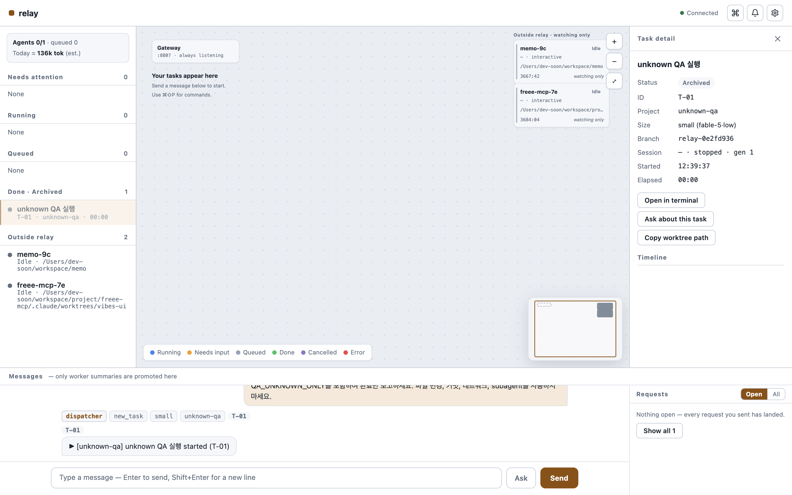

# Unknown-spawn close guard — 2026-09-05

Follow-up to the cleanup work in PR #53. A production HTTP/dispatcher/outbox reproduction created a roster row, then lost the spawn result before Relay recorded any identity. Close produced `closed` with one live roster row and zero process records.

Close now always performs close's stop preflight, including tasks with no identity. If a spawn was attempted but no identity was recorded, close stays visible and its stop command is unknown/retryable. A fresh roster supplies diagnostic candidates, but a renamed or not-yet-published row cannot be mistaken for proof that no process launched. No candidate is automatically stopped based on its name. The rm path also refuses an unidentified attempted launch. When the delayed authenticated SessionStart establishes identity, Retry cleanup stops and removes the owned row. Both stages are covered by the integration test.

Verification: typecheck, web build, and full suite **390 pass / 2 opt-in skip / 0 fail**, 1,691 assertions across 56 files. The independent compiled-binary smoke also passed. HTTP/dispatcher/hook integration tests cover a matching name, a renamed row, delayed roster publication, delayed authenticated identity, and safe close of a queued task that never attempted a launch.

**#37 remains open.** This is a bounded guard, not complete owned-session reconciliation. Without a delayed authenticated hook, an attempted launch with no identity deliberately stays unresolved; operator evidence or the future durable-adoption path is needed. Missing-hook adoption, generation enrichment, supervisor restarts after prior successful cleanup, and full owned/stale/orphan classification remain separate follow-up work.

## Real Claude reproduction

A second isolated server ran on port 8807 with its own home/logs/binary. The QA runner started a real Claude 2.1.261 worker, deliberately withheld injected hooks, then discarded the successful launcher result. Task `0e2fd936-b15d-412a-b895-0b960423aaa3` had no IDs/process records while native roster row `d2b89f60-7c24-4c74-b69d-5b3d123f2ac2` existed. The worker prompt prohibited tool use and file changes.

Close stayed `error` with an unknown stop naming the candidate; it did not stop or remove a row on name alone. The QA harness then replayed an authenticated SessionStart for that exact real session through HTTP, using its recorded generation and worktree. Retry cleanup converged after that identity evidence. This is deliberate hook-delay injection, not a claim that the native CLI naturally delayed its hook in this run.

Final native audit: the QA task was `closed`, stop/rm were `applied`, one process generation was recorded, the actual session was absent from the Claude roster, and the disposable repository contained only its original main worktree/branch at `d0a6196e8b19861f46108e91636a5e10862edc84`. Combined with PR #53, all eight QA session rows were removed; unrelated sessions were observed only.

Browser verification on the isolated server confirmed Connected, Archived, stopped, zero running/queued tasks, and both external sessions still watch-only.

