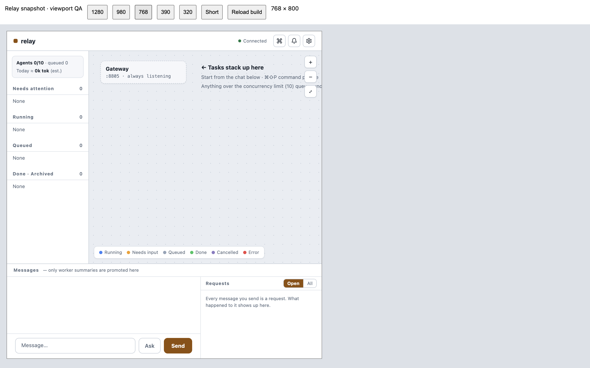
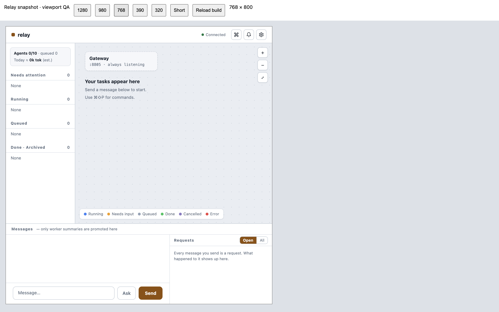

# Relay QA — 2026-09-05

## Implementation status

This pass started from local v0.1.3 (`fdf6415`) and fast-forwarded the clean checkout to
`origin/main` v0.1.4 (`277f32f`) before making changes. The working branch is
`codex/qa-polish-20260905`.

The existing product includes the Bun/Hono HTTP and WebSocket server, SQLite event log and
projections, dispatcher, native Claude workers and worktrees, hooks, permit queue, task
lifecycle, Ask, request ledger, graph dashboard, CLI, MCP bridge and binary packaging.
These are implemented features, not a claim that every original roadmap item is complete.

The current open issues still track provider-neutral execution and Codex (#46), durable goals
(#39), CLI TUI (#40), native-session Ask (#38), external-session consistency (#41), CLI drift
(#42), operational gates (#44), and release/review/fixture work (#43, #47, #48). This QA pass
does not close those feature and operations gaps. Issue state was read from GitHub on this date.

## Environments and evidence boundaries

- Bun 1.3.10, Claude Code 2.1.259, macOS arm64.
- `127.0.0.1:8801`: real Relay HTTP/WS/DB pipeline with `scripts/dev-fake.ts` scripted workers.
- `127.0.0.1:8802`: real Relay dispatcher and native Claude workers, `resume` delivery.
- `127.0.0.1:8803`: visual-only harness containing the built HTML and a captured server snapshot
  in an iframe. It exercises real CSS viewport sizing, but is not a live worker/API test.
- QA server state and the native sample Git repository live under `/tmp/relay-qa-20260905`.
  The fake harness uses its default disposable project under `/tmp/relay-fake`.
  The installed Relay database/configuration and unrelated Claude sessions were not modified.
- Desktop browser checks used a real 1440×900 browser. The browser controller could not resize
  its window, so 1280×800, 980×800, 768×800, 390×844, 320×568 and 1280×560 were exercised in
  the iframe harness. Physical phones, software keyboards, Safari and touch gestures were not tested.

## Defects fixed

| Problem and reproduction | Change |
|---|---|
| Send during a network failure erased the draft and task-scoped Ask before acknowledgement | Clear only on success; retain draft/scope, show failure, prevent repeated submissions while pending |
| Retrying a request after its HTTP acknowledgement was lost could create another task | Reuse the failed attempt's client message ID; a changed draft/scope or successful repeat gets a new ID |
| Initial snapshot HTTP failure left the WebSocket open but the UI unable to finish syncing | Close and reconnect on failed HTTP/JSON sync; abort obsolete fetches |
| A slow snapshot could overwrite state from a newer connection after reconnect | Discard results belonging to a closed connection |
| Refresh discarded the selected task | Restore the selected task UUID per browser tab and fetch its detail history |
| Needs-input graph card still showed the last Bash command; queued cards had no useful caption | Prefer the active question; show a slot-waiting caption for queued tasks |
| Multiline messages collapsed whitespace; long unbroken text could overflow | Preserve line breaks and wrap long content |
| At 390/320px the fixed 200px sidebar left only 190/120px for the graph | Add a compact task-list drawer and visible toggle; selecting a task closes the drawer |
| Narrow detail overlay started at y=96 instead of y=48 | Remove the absolute overlay's inherited grid placement |
| At 320×568 and 1280×560 the 662px settings panel extended to y=718 and could not scroll | Bound the panel to the viewport and allow vertical scrolling |
| The 320px notification panel started at x=-12 on a 320px screen | Bound popover width to viewport minus margins |
| Tablet sidebar hiding left a fixed empty column; aligned chat could be narrower than its ledger | Honor the sidebar width variable; adapt the ledger to chat container width |
| Legend/minimap competed for narrow graph space and global toasts could cover detail controls | Wrap legend, hide the narrow minimap, and position toasts inside the graph beside zoom controls |
| Long placeholder enlarged an empty composer on narrow screens | Use a shorter placeholder at small input widths and keep empty input at one row |

## Live execution results

| Scenario | Observed result |
|---|---|
| Native dispatcher → small read-only task | T-01 read the sample README and Git status, completed through real hooks |
| Direct follow-up to T-01 | Same task resumed as process generation 2 and returned the README heading |
| Ask about T-01 | Independent dispatcher answer described the actual reads; no new task or worker mutation |
| Native implementation prompt | T-02 created `sum.ts` and `sum.test.ts`, ran 2 passing Bun tests and made local commit `7af1469` |
| Independent artifact check | Read both generated files, inspected the commit, reran the two tests successfully |
| Worker guard behavior | One compound shell command was refused by the CLI worktree guard; the worker split the commands and completed successfully |
| Global pause → submit → resume | Server snapshot showed `paused=true` and request `pending`; resume processed it |
| Restart server against same DB | Recovery reconciled 2 tasks; no crashes, orphan adoption or invariant violations; running=0, leases=0 |
| Fake browser normal/question/epic/error | Done; Needs input → answer → Done; two subnodes → Done; Error → Restart → Done |
| Fake browser status and Ask | Fast-path status and dispatcher answers; no unintended tasks |
| Browser reload after answering | Tasks and messages restored without exception; selected detail also restored after the fix |
| Browser injected POST failure | Draft and scoped Ask retained, failure visible, retry succeeded and cleared input |
| Browser lost acknowledgement after server 202 | Two POST attempts used the same client message ID; after reload the server-backed UI contained exactly one user message |
| Browser multiline + long identifier | Preserved newlines, wrapped long content, document horizontal overflow 0 at desktop size |

Native evidence is stored in `native-evidence.json`, `native-followup.json`,
`native-implementation.json` and `native-paused.json` under the QA directory.
The sample worktree and its local commit are retained as evidence. No sample commit was pushed.

## Responsive verification

All six iframe sizes had document horizontal overflow **0**, and the input and Send button
were fully inside their viewport. At 390/320px the graph now uses the full viewport width;
selecting a task closes the compact drawer and opens detail at y=48.

| Check | Result after fix |
|---|---|
| 320×568 settings | x=12, y=56, width=296, height=500; 12px bottom margin; scrolling exposes Register |
| 1280×560 settings | height=492; 12px bottom margin; scrolling exposes Register |
| 320px notifications | x=12, width=296; no clipping |
| 980/768px hidden sidebar | Canvas starts at x=0 and uses the full width; no empty 200px column |
| 1280px center/right/left chat | Send remains fully visible in every alignment |
| Desktop and 390/320px empty composer | 38px, rows=1, scrollHeight=clientHeight=36 after final placeholder fix; compact Send has 10px right/bottom clearance |

Browser console errors were 0 on both live QA servers during the checked flows.

## Reproduce

Use a fresh temporary directory and an unused port to avoid sharing an installed service's state:

```sh
bun run build:web
mkdir -p /tmp/relay-qa-local
printf 'port = 8801\n' > /tmp/relay-qa-local/config.toml
RELAY_HOME=/tmp/relay-qa-local RELAY_LOG_DIR=/tmp/relay-qa-local/logs bun scripts/dev-fake.ts
```

Open `http://127.0.0.1:8801/` and submit `상태?`, `hello relay`,
`myapp auth 리팩토링`, `myapp 질문 있는 작업`, `myapp 에픽 작업`, and `myapp 오류 나는 작업`.
Answer `a.txt`, reload the selected detail, and restart the error task.

For real workers, use another `RELAY_HOME`, register a disposable Git project, point `RELAY_BIN`
at the absolute `scripts/relay-dev` path and start `bun src/main.ts serve`. This uses the user's
existing Claude login and consumes real subscription usage. The native sample above used the
normal dispatcher and worker models from defaults, without a scripted dispatcher.

## Validation scope

The ordinary suite's real-CLI and binary tests are opt-in. This pass separately compiled and
ran the binary smoke and separately exercised the real dispatcher/worker flows described above.
A test-suite skip is therefore not being counted as live evidence. Homebrew installation,
launchd, socket delivery, remote deployment and the broader open operations issues remain
outside this source-checkout QA pass.


Final automated validation: `bunx tsc --noEmit` passed; `bun test` reported **357 pass,
2 opt-in skips, 0 fail** across 55 files (1,571 assertions). Fourteen regression tests cover
failed submissions, repeat Enter/IME, message retry identity, snapshot recovery, empty-scene fitting and explicit selection clearing.
The generated native sample also passed its two tests independently.

The final compiled binary smoke passed **1 test / 4 assertions**: stamped version,
HTTP dashboard/token injection and fail-closed hook guard. Both native tasks are Done with
worker processes stopped; there are no outstanding commands or invariant violations.
The two QA servers are left running on loopback for inspection.

## Screenshots and measurements

Browser artifacts are retained locally:

- Native completion and restart: `/Users/dev-soon/.aside/u/0/sessions/2026-09-05_awBmqIlXDLMSpPH9/tmp/relay-qa-20260905-fixed-build/13-claude-8802-after-restart-final.png`
- Failed submission with retained draft: same directory, `05-fixed-ask-post-failure-draft-preserved.png`.
- Final 320px composer: `/Users/dev-soon/.aside/u/0/sessions/2026-09-05_qU5TyIRgNoey4dC2/tmp/fixed-empty-composer-320.png`.
- Final viewport measurements: same directory, `fixed-relay-qa-measurements.json`; empty composer was rechecked afterward as recorded above.

Viewport screenshots include the temporary harness toolbar and surrounding browser page.
The harness toolbar encoding artifact is outside the product iframe.


## Follow-up: first launch with no sessions

Tracked by [#51](https://github.com/JeongJaeSoon/relay/issues/51). The initial pass covered populated
and waiting/error states but did not adequately cover a completely empty graph. On follow-up,
a fresh real server on port 8804 and snapshot harness on 8805 had zero tasks and zero foreign
sessions. The old empty guidance remained 400px wide to the right of Gateway, and `fit()`
considered only Gateway, so document overflow=0 concealed actual canvas clipping.

- At 768px the guidance overlapped the zoom controls by 1,950px².
- At 390px its right edge was x=674, outside the viewport by 284px.
- Radial fitting could put the guidance entirely outside a 320px canvas.

The guidance now sits below Gateway, wraps within the available canvas width, and participates
in fit bounds in both Steps and Radial. The copy gives a short next action and no longer
hard-codes the concurrency limit as 10. Populated graphs retain their previous fitting behavior.
Two regression tests execute the actual fitting code over six canvas sizes and both layouts;
they assert that guidance stays clear of Gateway, zoom controls and the legend area, and that
hidden guidance does not affect populated fitting.

Before/after browser artifacts are retained under
`/Users/dev-soon/.aside/u/0/sessions/2026-09-05_XpcxKyagq8gJrUrt/artifacts/`.

A final source review also found that the detail Close button captured the original handler
before the persistence adapter was installed. It now resolves the installed handler at click
time, so closing a detail clears its saved selection instead of reopening it after refresh.
The regression test failed before this one-line fix and passed afterward.


Browser revalidation: fresh live server plus Steps at 1280×800, 980×800, 768×800, 390×844,
320×568 and 1280×560; Radial at 320×568 and 1280×800. The hint has zero canvas clipping
and zero intersection with Gateway, zoom controls and legend in each checked state.
The explicit close → reload selection case also passed on the live populated server.

| Before: clipped hint and zoom overlap | After: complete guidance below Gateway |
|---|---|
|  |  |

These screenshots show only the disposable empty QA server, with no user conversations or
external sessions. The surrounding toolbar belongs to the viewport harness.


## PR review follow-up

CodeRabbit reviewed the PR through `fa0daf5`. Three findings were addressed: failed detail
loads now release only their own cache marker (including an A→B→A race), identical in-flight
sender calls share one HTTP request, and an initial snapshot that stalls is aborted after
10 seconds and reconnects. Four added tests cover these behaviors, including a fetch that
never settles. The proposed empty-hint fixture change was declined: the old starting geometry
is deliberate, because the test verifies that actual `fit()` recalculates it; both local and
CI tests passed before that comment. The fixture now explains this intent.
